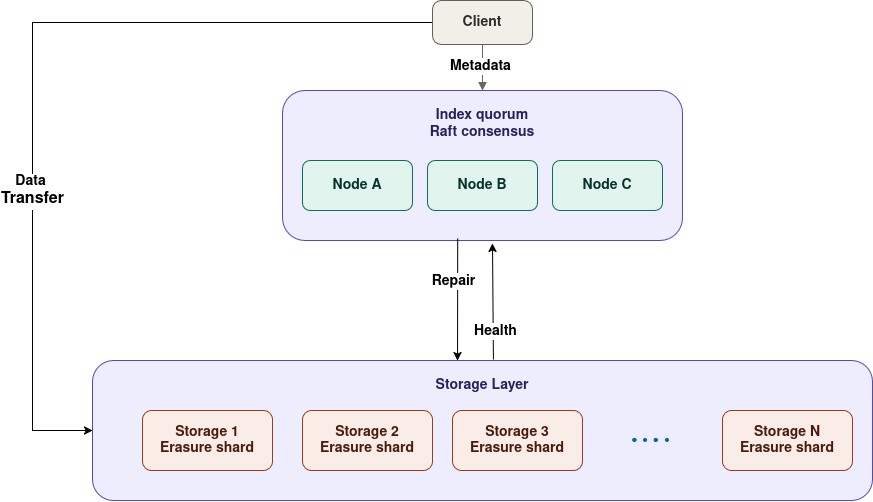

# Overview

An Arkel deployment has three kinds of participants:
- **Clients** encrypt and erasure-code objects locally. 
- **Index nodes** form a Raft cluster that owns the global metadata. 
- **Storage nodes** hold encrypted shards that store data.

## Participants

| Role | Command | Holds | Responsibilities |
| --- | --- | --- | --- |
| Client | `arkel client` | Master key, plaintext | Encrypt, erasure-code, build & sign manifests, fetch shards |
| Index node | `arkel index` | Raft log + SQLite state | Catalog, ownership, quotas, node registry |
| Storage node | `arkel storage` | Encrypted shard blobs | Register, store, serve, garbage-collect |

## Write path

1. The client picks storage targets from the healthy-node list and chooses an
   erasure configuration (`k` data + `m` parity shards; default **8 + 6**).
2. The object is **encrypted on the client** with XChaCha20-Poly1305, using a
   per-object key derived via HKDF-SHA256 from the master key.
3. The ciphertext is **erasure-coded** into `k + m` shards.
4. The client hosts the shards locally and each storage node **pulls** its
   assigned shard over QUIC. Shards are content-addressed by BLAKE3.
5. The client builds a **manifest** (object hash, sizes, shard placements),
   signs it, and commits it to the index cluster via Raft.

Because encryption happens before coding, every storage node only ever holds a
slice of ciphertext.

## Read path

1. The client reads the manifest from the index cluster (owner-gated).
2. It fetches the `k` data shards in parallel, substituting parity shards if any
   are missing, and reconstructs the ciphertext.
3. It decrypts once and verifies the plaintext against the manifest's BLAKE3
   object hash. A corrupted or malicious shard fails the check.

Reads only need `k` of the `k + m` shards, so the object survives losing up to
`m` nodes.

## The index cluster

The metadata — buckets, objects, ownership, quotas, and the storage-node
registry — is a replicated state machine built on **OpenRaft**. Every write
(manifest commit, quota credit, node registration) is a log entry committed to a
quorum of index nodes and applied deterministically to each node's SQLite state.

Reads are served under a **leader lease** and metadata is kept linearizable.

## Storage nodes

Storage nodes hold shards as content-addressed blobs in an iroh-blobs store.
They register their advertised address and capacity with the index, send
heartbeats, and run a background **Garbage collection loop** to clean up dead references.

## Background work

- **Repair** — a standalone, idempotent `arkel repair` pass finds objects below
  their target `k`/`m` and re-encodes and redistributes shards.
- **Garbage collection** — storage nodes delete unreferenced shards on an
  interval; the index authorizes deletions scoped to the node's own placements.
- **Contribution grants** — the index periodically credits operators for the
  bytes they host, subject to an online grace period.
